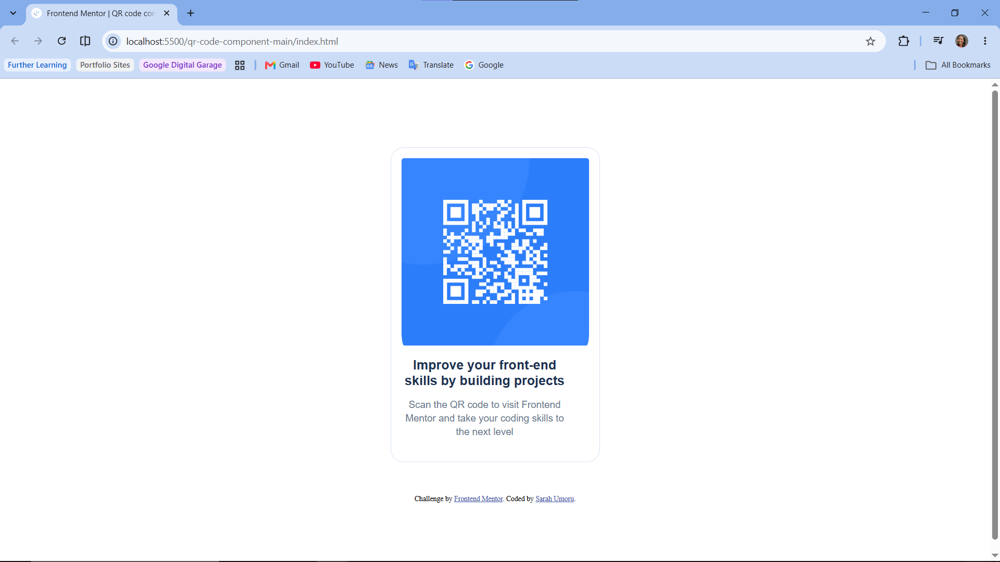

# Frontend Mentor - QR code component solution

This is a solution to the [QR code component challenge on Frontend Mentor](https://www.frontendmentor.io/challenges/qr-code-component-iux_sIO_H). Frontend Mentor challenges help you improve your coding skills by building realistic projects. 

## Table of contents
  - [Screenshot](#screenshot)
  - [Links](#links)
- [My process](#my-process)
  - [Built with](#built-with)
  - [What I learned](#what-i-learned)
  - [Continued development](#continued-development)
  - [Useful resources](#useful-resources)
  - [AI Collaboration](#ai-collaboration)
- [Author](#author)

### Screenshot

### Links

- Solution URL: [https://god-delight.github.io/QR-code-component-Solution/]

## My process

### Built with

- Semantic HTML5 markup
- CSS custom properties
- Flexbox
- Mobile-first workflow

### What I learned

I learnt how to use flexbox in real situations...thats what i used to centralise my cards. It was also my first time making something responsive. I had to learn how to do that.

### Continued development

Going forward, i'll do more practicals that have to do with creating components, so i can build muscle memory and comletetly master it.

### Useful resources
i used the vs code in built agent, following the "Agents.md" document that was given to me for this project, to debug my code and walk me through some code fixes, explaining why and how to me.

### AI Collaboration

i used the vs code in built agent, following the "Agents.md" document that was given to me for this project, to debug my code and walk me through some code fixes, explaining why and how to me.

## Author

- Website - [Sarah Umoru](https://god-delight.github.io/QR-code-component-Solution/)
- Frontend Mentor - [@God-Delight](https://www.frontendmentor.io/profile/God-Delight)

